# 🚀 QubeDB - Master Development Roadmap
## From MVP to Production-Ready Database

> **Mission**: Membangun database modern dari nol (Rust) sampai production-ready, bisa dipakai developer seperti MySQL/Postgres, dengan fitur multi-model (Relational, Document, Graph, Vector, Time-series) dan AI-native optimization.

---

## 📊 **Current Status Analysis**

### ✅ **Yang Sudah Ada (MVP Foundation)**
- ✅ **Multi-Model Engine**: Relational, Document, Graph, Vector, Time-series
- ✅ **Rust Performance**: High-speed, memory-efficient operations
- ✅ **Framework Integration**: PHP, Python, Java, Node.js, Go, Rust
- ✅ **Web GUI**: Modern web-based management interface
- ✅ **Logging System**: Comprehensive error tracking and monitoring
- ✅ **HTTP API Server**: Running on localhost:8080
- ✅ **Storage Foundation**: Basic file-based persistence
- ✅ **Query Engine**: SQL parser and execution engine
- ✅ **Production Ready**: Stable for development use

### 🎯 **Gap Analysis - Yang Perlu Dibangun**
- ❌ **ACID Transactions**: Full transaction support dengan MVCC
- ❌ **Advanced Storage**: WAL + BTree/LSM + Buffer Pool
- ❌ **Query Optimization**: Cost-based optimizer
- ❌ **Production Networking**: gRPC, Postgres wire protocol
- ❌ **Client Libraries**: Official SDKs untuk semua bahasa
- ❌ **High Availability**: Replication, backup, monitoring
- ❌ **Enterprise Features**: Security, compliance, multi-tenancy

---

## 🗺️ **Visual Development Flow**

```mermaid
graph TD
    A[🎯 MVP Phase<br/>Current Status] --> B[🔧 Core Engine Phase<br/>3-6 months]
    B --> C[🛠️ SQL Layer Phase<br/>4-8 months]
    C --> D[🌐 Network & Protocol Phase<br/>2-4 months]
    D --> E[🔌 Client Libraries Phase<br/>3-6 months]
    E --> F[🚀 Production Features Phase<br/>4-8 months]
    F --> G[📈 Enterprise Features Phase<br/>6-12 months]
    G --> H[🌍 Global Scale Phase<br/>12-24 months]

    A --> A1[✅ Multi-Model Engine<br/>✅ GUI Interface<br/>✅ Framework Integration<br/>✅ Logging System]
    
    B --> B1[WAL + Memtable<br/>Page Store + Buffer Pool<br/>B+Tree Indexing<br/>Transaction Manager]
    B --> B2[Checkpoint + Recovery<br/>ACID Compliance<br/>Memory Management<br/>Storage Optimization]
    
    C --> C1[SQL Parser<br/>Query Planner<br/>Cost-Based Optimizer<br/>Execution Engine]
    C --> C2[Index Selection<br/>Join Algorithms<br/>Aggregation Functions<br/>Subquery Support]
    
    D --> D1[HTTP REST API<br/>gRPC Protocol<br/>Postgres Wire Protocol<br/>WebSocket Support]
    D --> D2[Connection Pooling<br/>Authentication<br/>Rate Limiting<br/>Load Balancing]
    
    E --> E1[Rust SDK<br/>Node.js Driver<br/>Python Client<br/>PHP PDO Driver]
    E --> E2[Java JDBC<br/>Go Driver<br/>C# Client<br/>Ruby Gem]
    
    F --> F1[High Availability<br/>Replication<br/>Backup & Recovery<br/>Monitoring]
    F --> F2[Security Features<br/>Encryption<br/>Audit Logging<br/>Performance Tuning]
    
    G --> G1[Multi-tenant<br/>Enterprise SSO<br/>Compliance Tools<br/>Advanced Analytics]
    G --> G2[AI-Powered Optimization<br/>Auto-indexing<br/>Predictive Scaling<br/>Anomaly Detection]
    
    H --> H1[Global Distribution<br/>Edge Computing<br/>Mobile Support<br/>API Ecosystem]
    H --> H2[Cloud Integration<br/>Kubernetes<br/>Serverless<br/>Multi-Cloud]
```



---

## 📅 **Detailed Implementation Timeline**

### **Phase 1: Core Engine Enhancement (Months 1-6)**
**Goal**: Solid, production-ready database engine

#### **Month 1-2: Storage Foundation**
- [ ] **WAL Implementation**
  - [ ] WAL file format design
  - [ ] Async WAL writing dengan batching
  - [ ] Recovery mechanism dari WAL
  - [ ] WAL truncation dan cleanup

- [ ] **Page Store System**
  - [ ] 8KB page format design
  - [ ] Buffer pool dengan LRU cache
  - [ ] Page allocation dan deallocation
  - [ ] Efficient disk I/O operations

#### **Month 3-4: Indexing System**
- [ ] **B+Tree Implementation**
  - [ ] B+Tree structure dan operations
  - [ ] Insert, delete, search operations
  - [ ] Range queries dan point queries
  - [ ] Index maintenance dan statistics

- [ ] **LSM Tree Option**
  - [ ] LSM tree untuk write-heavy workloads
  - [ ] Compaction strategies
  - [ ] Bloom filters untuk false positives
  - [ ] Tiered storage management

#### **Month 5-6: Transaction Management**
- [ ] **MVCC Implementation**
  - [ ] Multi-version concurrency control
  - [ ] Snapshot isolation
  - [ ] Version cleanup dan garbage collection
  - [ ] Conflict detection dan resolution

- [ ] **ACID Compliance**
  - [ ] Atomicity dengan rollback mechanism
  - [ ] Consistency dengan constraint checking
  - [ ] Isolation dengan lock management
  - [ ] Durability dengan WAL integration

**Deliverables**:
- Production-ready storage engine
- ACID transaction support
- High-performance indexing

---

### **Phase 2: SQL Layer Implementation (Months 7-14)**
**Goal**: Full SQL compatibility dan query optimization

#### **Month 7-8: SQL Parser & Planner**
- [ ] **SQL Grammar**
  - [ ] Complete SQL standard support
  - [ ] DDL: CREATE, DROP, ALTER, TRUNCATE
  - [ ] DML: INSERT, SELECT, UPDATE, DELETE
  - [ ] DCL: GRANT, REVOKE, COMMIT, ROLLBACK

- [ ] **Query Planning**
  - [ ] AST generation dan validation
  - [ ] Logical planning dengan operators
  - [ ] Physical planning dengan execution strategies
  - [ ] Query optimization rules

#### **Month 9-10: Query Optimization**
- [ ] **Cost-Based Optimizer**
  - [ ] Statistics collection dan maintenance
  - [ ] Cost estimation models
  - [ ] Index selection algorithms
  - [ ] Join order optimization

- [ ] **Advanced Features**
  - [ ] Subquery optimization
  - [ ] Window functions support
  - [ ] Common Table Expressions (CTEs)
  - [ ] Recursive queries

#### **Month 11-12: Execution Engine**
- [ ] **Operator Implementation**
  - [ ] Scan operators (table scan, index scan)
  - [ ] Join operators (nested loop, hash, merge)
  - [ ] Aggregate operators (GROUP BY, HAVING)
  - [ ] Sort operators (external merge sort)

- [ ] **Parallel Execution**
  - [ ] Multi-threaded query execution
  - [ ] Parallel scan dan join operations
  - [ ] Memory management per query
  - [ ] Result streaming dan pagination

#### **Month 13-14: Advanced SQL Features**
- [ ] **Window Functions**
  - [ ] ROW_NUMBER, RANK, DENSE_RANK
  - [ ] LAG, LEAD, FIRST_VALUE, LAST_VALUE
  - [ ] OVER clause support
  - [ ] Partitioning dan ordering

- [ ] **Analytic Functions**
  - [ ] Statistical functions
  - [ ] Time-series functions
  - [ ] Machine learning functions
  - [ ] Custom function support

**Deliverables**:
- Complete SQL engine
- Advanced query optimization
- High-performance execution

---

### **Phase 3: Network & Protocol Layer (Months 15-18)**
**Goal**: Production-ready networking dan protocols

#### **Month 15-16: Protocol Implementation**
- [ ] **HTTP REST API**
  - [ ] RESTful endpoints untuk CRUD operations
  - [ ] JSON serialization/deserialization
  - [ ] OpenAPI/Swagger documentation
  - [ ] Rate limiting dan throttling

- [ ] **gRPC Protocol**
  - [ ] High-performance RPC service
  - [ ] Protocol Buffers message format
  - [ ] Bidirectional streaming
  - [ ] Error handling dan status codes

#### **Month 17-18: Advanced Protocols**
- [ ] **Postgres Wire Protocol**
  - [ ] PostgreSQL wire protocol compatibility
  - [ ] libpq client support
  - [ ] psycopg2, pgAdmin compatibility
  - [ ] Existing tool integration

- [ ] **WebSocket Support**
  - [ ] Real-time connections
  - [ ] Live query results
  - [ ] Event notifications
  - [ ] Bidirectional communication

**Deliverables**:
- Multiple protocol support
- High-performance networking
- Tool compatibility

---

### **Phase 4: Client Libraries (Months 19-24)**
**Goal**: Easy integration untuk developers

#### **Month 19-20: Core SDKs**
- [ ] **Rust SDK**
  - [ ] Native Rust client library
  - [ ] Async/await support dengan Tokio
  - [ ] Connection pooling
  - [ ] Error handling dengan Result types

- [ ] **Node.js Driver**
  - [ ] JavaScript/TypeScript client
  - [ ] Promise-based API
  - [ ] NPM package distribution
  - [ ] Framework integrations (Express, NestJS)

#### **Month 21-22: Language Support**
- [ ] **Python Client**
  - [ ] PyPI package distribution
  - [ ] AsyncIO support
  - [ ] SQLAlchemy integration
  - [ ] Pandas DataFrame support

- [ ] **PHP PDO Driver**
  - [ ] PDO compatibility
  - [ ] Laravel Eloquent integration
  - [ ] Composer package
  - [ ] Framework support (Symfony, CodeIgniter)

#### **Month 23-24: Enterprise Languages**
- [ ] **Java JDBC Driver**
  - [ ] JDBC 4.0 compliance
  - [ ] Connection pooling (HikariCP)
  - [ ] Spring Boot auto-configuration
  - [ ] Maven Central distribution

- [ ] **Go Driver**
  - [ ] database/sql interface
  - [ ] Connection pooling
  - [ ] Context support
  - [ ] Go modules distribution

**Deliverables**:
- Complete language ecosystem
- Framework integrations
- Easy developer adoption

---

### **Phase 5: Production Features (Months 25-32)**
**Goal**: Enterprise-ready database system

#### **Month 25-26: High Availability**
- [ ] **Replication System**
  - [ ] Master-slave replication
  - [ ] Master-master replication
  - [ ] Streaming replication
  - [ ] Automatic failover

- [ ] **Backup & Recovery**
  - [ ] Automated backup system
  - [ ] Point-in-time recovery (PITR)
  - [ ] Incremental backups
  - [ ] Backup validation dan testing

#### **Month 27-28: Monitoring & Observability**
- [ ] **Metrics Collection**
  - [ ] Performance metrics (TPS, latency)
  - [ ] System metrics (CPU, memory, disk)
  - [ ] Query metrics (slow queries)
  - [ ] Error metrics dan alerting

- [ ] **Monitoring Integration**
  - [ ] Prometheus metrics export
  - [ ] Grafana dashboard creation
  - [ ] Alerting system
  - [ ] Log aggregation

#### **Month 29-30: Performance Optimization**
- [ ] **Query Optimization**
  - [ ] Query profiling dan analysis
  - [ ] Automatic index tuning
  - [ ] Statistics updates
  - [ ] Plan caching

- [ ] **System Optimization**
  - [ ] Memory tuning
  - [ ] I/O optimization
  - [ ] Concurrency tuning
  - [ ] Network optimization

#### **Month 31-32: Security Hardening**
- [ ] **Advanced Security**
  - [ ] Data encryption (at-rest dan in-transit)
  - [ ] TLS 1.3 support
  - [ ] Fine-grained access control
  - [ ] Comprehensive audit logging

- [ ] **Compliance**
  - [ ] GDPR compliance features
  - [ ] HIPAA support
  - [ ] SOC2 compliance
  - [ ] Vulnerability scanning

**Deliverables**:
- Production-ready system
- Enterprise security
- Comprehensive monitoring

---

### **Phase 6: Enterprise Features (Months 33-44)**
**Goal**: Large-scale enterprise deployment

#### **Month 33-34: Multi-tenancy**
- [ ] **Tenant Isolation**
  - [ ] Data isolation per tenant
  - [ ] Resource quotas
  - [ ] Tenant management
  - [ ] Per-tenant monitoring

- [ ] **Enterprise SSO**
  - [ ] SAML 2.0 integration
  - [ ] OAuth 2.0 support
  - [ ] LDAP/Active Directory
  - [ ] SSO dashboard

#### **Month 35-36: Sharding & Distribution**
- [ ] **Horizontal Sharding**
  - [ ] Shard key selection
  - [ ] Data distribution logic
  - [ ] Shard management
  - [ ] Cross-shard queries

- [ ] **Distributed Transactions**
  - [ ] Two-phase commit
  - [ ] Distributed locking
  - [ ] Consistency models
  - [ ] Conflict resolution

#### **Month 37-38: AI-Powered Features**
- [ ] **Auto-indexing**
  - [ ] ML-based index recommendations
  - [ ] Automatic index creation
  - [ ] Index maintenance
  - [ ] Performance impact analysis

- [ ] **Query Optimization**
  - [ ] AI-driven query improvement
  - [ ] Pattern recognition
  - [ ] Performance prediction
  - [ ] Anomaly detection

#### **Month 39-40: Advanced Analytics**
- [ ] **Time-series Support**
  - [ ] Time-series data types
  - [ ] Time-based indexing
  - [ ] Aggregation functions
  - [ ] Time-series queries

- [ ] **Vector Search**
  - [ ] Vector data types
  - [ ] Similarity search
  - [ ] Vector indexing
  - [ ] ML model integration

#### **Month 41-44: Enterprise Tools**
- [ ] **Management Tools**
  - [ ] Enterprise admin dashboard
  - [ ] User management
  - [ ] Resource management
  - [ ] Billing integration

- [ ] **Integration Framework**
  - [ ] API gateway
  - [ ] Webhook support
  - [ ] Third-party integrations
  - [ ] Custom extensions

**Deliverables**:
- Enterprise-ready features
- AI-powered optimization
- Advanced analytics

---

### **Phase 7: Global Scale (Months 45-60)**
**Goal**: Worldwide database platform

#### **Month 45-48: Global Distribution**
- [ ] **Multi-region Support**
  - [ ] Global data distribution
  - [ ] Cross-region replication
  - [ ] Latency optimization
  - [ ] Consistency models

- [ ] **Edge Computing**
  - [ ] Edge node deployment
  - [ ] Data synchronization
  - [ ] Offline support
  - [ ] Conflict resolution

#### **Month 49-52: Cloud Integration**
- [ ] **AWS Integration**
  - [ ] RDS-compatible service
  - [ ] CloudFormation templates
  - [ ] Lambda integration
  - [ ] CloudWatch monitoring

- [ ] **Multi-cloud Support**
  - [ ] Azure Database service
  - [ ] GCP Cloud SQL compatibility
  - [ ] Kubernetes deployment
  - [ ] Helm charts

#### **Month 53-56: Mobile & IoT**
- [ ] **Mobile Support**
  - [ ] iOS dan Android SDKs
  - [ ] Offline synchronization
  - [ ] Push notifications
  - [ ] Mobile analytics

- [ ] **IoT Integration**
  - [ ] MQTT, CoAP protocols
  - [ ] Time-series optimization
  - [ ] Edge processing
  - [ ] Device management

#### **Month 57-60: Market Launch**
- [ ] **Open Source Release**
  - [ ] GitHub repository
  - [ ] Documentation website
  - [ ] Community building
  - [ ] Contributor program

- [ ] **Commercial Offering**
  - [ ] Cloud service launch
  - [ ] Enterprise sales
  - [ ] Partner program
  - [ ] Training dan certification

**Deliverables**:
- Global platform
- Cloud services
- Market presence

---

## 🏗️ **Technical Architecture**

### **Storage Engine: Hybrid LSM + BTree**
```
Write Path:
Data → Memtable → WAL → Flush to SSTable → Compaction

Read Path:
Data → Memtable → SSTable → BTree Index → Disk
```

### **Query Engine: SQL Parser + Executor**
```
SQL Query → Parser → AST → Planner → Optimizer → Executor → Result
```

### **Transaction: MVCC + WAL**
```
Transaction → MVCC → WAL → Commit/Rollback → Recovery
```

### **Networking: Multi-Protocol**
```
Client → HTTP/gRPC/Postgres → Router → Query Engine → Storage
```

---

## 🎯 **Success Metrics & KPIs**

### **Technical Milestones**
- [ ] **Performance**: 100K+ TPS, <1ms latency
- [ ] **Scalability**: 1TB+ per instance, 1000+ concurrent users
- [ ] **Availability**: 99.99% uptime, <1 minute recovery
- [ ] **Compatibility**: 95% SQL standard compliance

### **Business Milestones**
- [ ] **Users**: 10K+ active developers
- [ ] **Customers**: 100+ enterprise clients
- [ ] **Revenue**: $1M+ ARR
- [ ] **Community**: 1K+ GitHub stars, 100+ contributors

### **Quality Metrics**
- [ ] **Test Coverage**: 90%+ code coverage
- [ ] **Documentation**: 100% API documentation
- [ ] **Security**: Zero critical vulnerabilities
- [ ] **Performance**: 95th percentile <10ms

---

## 🚀 **Getting Started**

### **Immediate Actions (This Week)**
1. **Setup Development Environment**
   ```bash
   cd qubedb-core
   cargo build
   cargo test
   ```

2. **Start WAL Implementation**
   - Create `src/storage/wal.rs`
   - Implement basic WAL operations
   - Add comprehensive tests

3. **Design Storage Format**
   - Define WAL file format
   - Define BTree page format
   - Create serialization/deserialization

### **For Core Team**
1. **Review Roadmap**: Understand complete plan
2. **Assign Responsibilities**: Team member roles
3. **Set Up Infrastructure**: Development environment
4. **Start Phase 1**: Begin core engine enhancement

### **For Contributors**
1. **Fork Repository**: Create your own fork
2. **Pick Issues**: Choose from roadmap tasks
3. **Submit PRs**: Contribute to development
4. **Join Community**: Connect with other developers

### **For Enterprises**
1. **Contact Sales**: enterprise@qubedb.com
2. **Schedule Demo**: See QubeDB capabilities
3. **Pilot Program**: Try in your environment
4. **Full Deployment**: Scale to production

---

## 📚 **Resources & References**

### **Technical References**
- [RocksDB Architecture](https://rocksdb.org/)
- [PostgreSQL Internals](https://www.postgresql.org/docs/current/internals.html)
- [SQLite Architecture](https://www.sqlite.org/arch.html)
- [LSM-Tree Paper](https://www.cs.umb.edu/~poneil/lsmtree.pdf)

### **Rust Libraries**
- `bincode` - Binary serialization
- `tokio` - Async runtime
- `sqlparser` - SQL parsing
- `serde` - Serialization
- `tracing` - Logging

### **Testing Tools**
- `criterion` - Benchmarking
- `proptest` - Property testing
- `tokio-test` - Async testing

---

## 💰 **Business Model**

### **Revenue Streams**
- [ ] **Community Edition** (Free) - Build userbase
- [ ] **Enterprise Edition** (Paid) - Advanced features
- [ ] **Cloud DBaaS** (Subscription) - Monthly/yearly plans
- [ ] **Support & Consulting** (Services) - Annual contracts
- [ ] **Training & Certification** (Education) - Course fees

### **Target Markets**
- [ ] **Startups** - Affordable, scalable solution
- [ ] **SMEs** - Mid-market database needs
- [ ] **Enterprises** - Large-scale deployments
- [ ] **Developers** - Individual developers
- [ ] **Consultants** - Database consulting
- [ ] **Educational** - Universities & training centers

---

**QubeDB** - Building the future of databases, one commit at a time! 🚀

*Last updated: $(date)*
